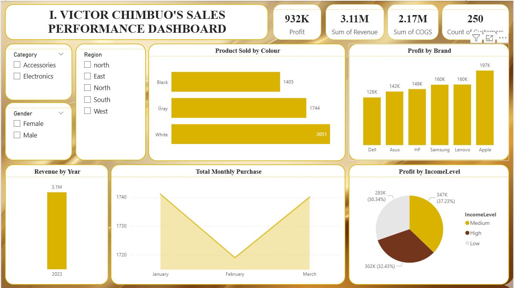

# 📊 Sales Analytics Dashboard – Power BI (End-to-End Project)

## 🔹 Project Overview
This project demonstrates an end-to-end data analytics workflow using Power BI, from data cleaning and transformation to data modeling, DAX calculations, and interactive dashboard design.

The objective was to transform raw sales data into meaningful insights that support data-driven decision-making.

---

## 🔹 Dashboard Preview


> 📌 This dashboard provides a high-level view of sales performance, highlighting key trends in revenue, profit, and customer behavior.

---

## 🔹 Tools & Technologies
- Power BI  
- Power Query (Data Transformation)  
- DAX (Data Analysis Expressions)  
- Data Modeling  
- Data Visualization  

---

## 🔹 Data Preparation
- Imported raw dataset into Power BI  
- Performed data quality checks  
- Handled missing values and removed irrelevant records  
- Selected relevant columns for analysis  
- Cleaned and transformed data using Power Query  

---

## 🔹 Data Modeling
- Established relationships between tables  
- Ensured accurate data connections  
- Optimized the data model for performance  

---

## 🔹 Feature Engineering
Created calculated columns:
- **Revenue** = Quantity × Selling Price  
- **COGS (Cost of Goods Sold)** = Quantity × Unit Price  

---

## 🔹 DAX Measures
```DAX
Profit = SUMX(Sales, Sales[Revenue] - Sales[COGS])
